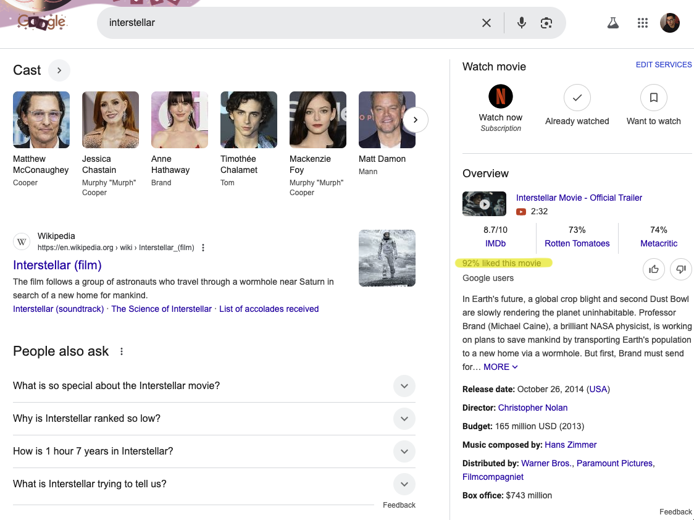
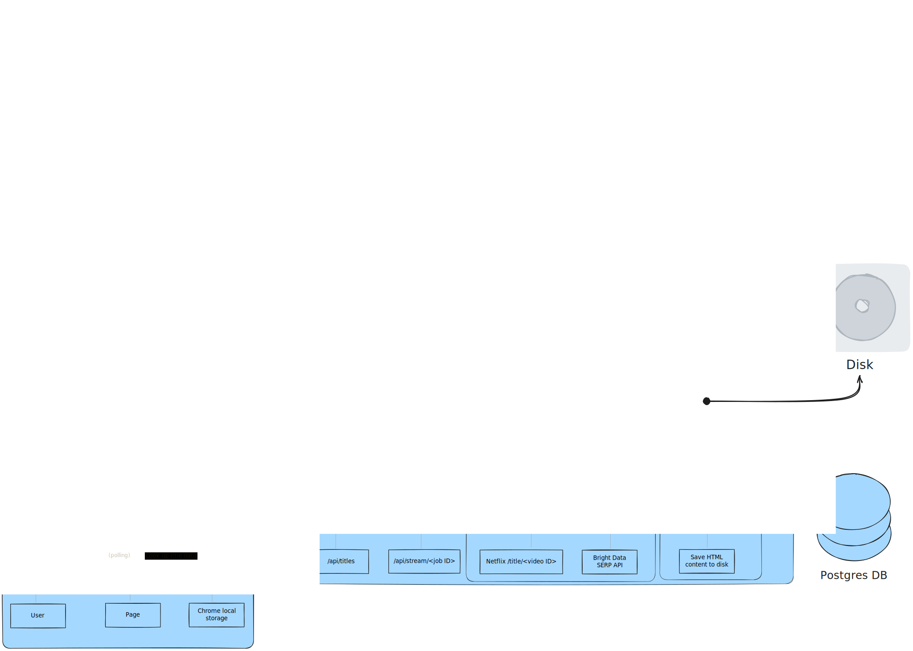
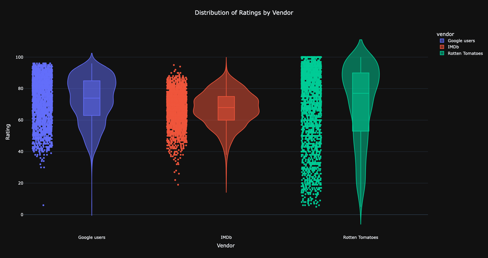

# Netflix Critic 🕵️


## Demo
<p align="center">

</p>

## Motivation
I sometimes spend up to half an hour looking for something to watch on Netflix. Finding something that's guaranteed to not be a waste of time is a huge challenge, and going in blind is a risk I'm not usually willing to take.

### Ratings
Ratings are usually a pretty good signal of quality — you can be reasonably certain you'll enjoy a show or movie that's been rated 9/10 by other viewers, unless you have some really niche taste or you're one of those contrarians types.

But why specifically the 'Google users' rating? Simply put, I've found it to be more reliable than any other ratings vendor. In my experience, Rotten Tomatoes and IMDb are often way off the mark (see the [insights section](#insights-from-the-data) below). I still collect the ratings from these vendors if they're available on the SERP, though.

But the reason I conceived this project in the first place was to collect that coveted percentage you see when you google a title:

<p align="center">

</p>

## Running Locally
First things first, clone this repo:
`git clone --recurse-submodules https://github.com/adosib/netflix_critic.git`

The extension isn't stand-alone because it depends on the web server (and the Postgres database) to pull data from, so at a minimum you'll need to have [Docker](https://www.docker.com/get-started/) installed.

Once you have Docker installed, open a terminal **from the project root directory** and run 
`docker compose up` after which your local webserver and database will be up and running.

Next you just have to add the extension:
1. Open a browser and navigate to chrome://extensions/
2. Toggle 'Developer mode'
3. Load unpacked extension
4. Select the extension-core directory

At this point you should be set. Now you can browse Netflix, enhanced with ratings.

<p align="center">

</p>

### (Optional) Collecting Ratings Data
Optional: If you additionally want to actively pull down ratings data for titles that aren't readily available in the database, you should be able to get a free trial with some credits for the [Bright Data SERP API](https://brightdata.com/products/serp-api).

Beyond the free trial credits, it's pay-as-you-go at a rate of $1.50/1000 requests (as of the time of writing), which is very reasonably priced.

Once you've signed up all you need to do is create a .env file at the project root with an environment variable that holds your Bearer authentication token:

```
BRD_AUTH_TOKEN=...
```
*path/to/netflix_critic/.env*

If your zone is called something different from 'serp_api1' then you'll have to set that environment variable, too. You can add the following near the other ENV declarations in the [Webserver.dockerfile](./Webserver.dockerfile):
```
ENV BRD_ZONE=...
```

## How it works
The below diagram roughly represents how things work. The most important high-level things to note:
- There is a critical JavaScript context variable that is collected and parsed from Netflix's title page (must be on an unauthenticated session) which supplies all the title data (release year, content type, metadata)
- The SERP content is retrieved using Bright Data's SERP API
- Data is sent from the web server to the front end via Server Sent Events (SSE)
<p align="center">

</p>

## Learnings

### Insights from the data
Out of 2,356 titles that had ratings from all 3, the distribution shows a clear difference ([code](./scripts/throwaway/plot_ratings.py)):
- Google reviews tend to be more positive compared to IMDb
- Rotten Tomatoes has a slighly higher median rating compared to Google users, but also FAR more variance
- IMDb ratings follow an almost perfect normal distribution, which is suspect to me. I don't think one would expect that with ratings data and I believe it's because of their proprietary [weighting system](https://help.imdb.com/article/imdb/track-movies-tv/weighted-average-ratings/GWT2DSBYVT2F25SK#).

<p align="center">

</p>

### I also learned..
- Netflix isn't too kind to IP addresses that issue more than 5 requests/second (they start sending back 403s).
- Semaphores alone are not very good at rate limiting (e.g. if you use a semaphore to allow 5 concurrent tasks, each of which is sending some GET requests, you still are not in control of rps even if you add a sleep call).
- The Apache HTTP Server Project has a neat command [ab](https://httpd.apache.org/docs/current/programs/ab.html) that was useful for validating the webserver setup.
- When using SSEs with [EventSource](https://developer.mozilla.org/en-US/docs/Web/API/EventSource), you might lose a day debugging if you don't know that `EventSource` really likes endpoints that unambiguously return the mime type `text/event-stream` with an OPTIONS request (i.e. having /api/titles accept POST requests with mime type `application/json` and return responses with type `text/event-stream` is no good).
- Web browsers don't send HTTP/2 requests unless it's over TLS ([the local web server actually supports HTTP/2!!](https://hypercorn.readthedocs.io/en/latest/discussion/http2.html) but I only get HTTP/1 requests, what a waste).
- [PythonMonkey](https://pythonmonkey.io/) is awesome!!
- SQLModel is just a thin wrapper around SQL Alchemy (I spent too much time scratching my head at the lack of an API reference).
- `pg_restore` really does not like having the environment variable `PGHOST` set.


## Future Work / Loose Ends
- Testing is non-existent.
- Error handling could use some improvement.
- The data in the titles table needs to be cleaned up. There's a lot of "titles" in there that actually correspond to seasons and episodes (from the seed data). It poisons the data model (mixed entities).
- The SERP logic is not perfect and there are sometimes false positives especially for basic movie titles i.e. those one-word titles like "Monster." There are a number of different approaches for this problem; one that's certainly worth exploring is searching by the title's thumbnail image.
- The cost for 1000 Google user ratings is currently sitting around $2.82. The data could be used to drive this toward the optimum of $1.50 (API cost per 1000 requests) by e.g. querying the logs for which "format" of query tends to perform best on first iteration (see [_build_query](./netflix_critic_data/scripts/database_setup/common.py))
- I'd love to include a Reddit sentiment score as part of this. I find the discussions on Reddit are also really helpful for gauging whether or not a movie is worth the watch.
- `JobStore` is not really designed for concurrency, and likely not thread-safe (also not ideal to indefinitely persist that data in memory - need a proper caching mechanism). Same goes for classes like `NetflixSessionHandler` and `BrightDataSessionHandler`.
- The Bright Data API returns a json data structure with more than just the page HTML - might be worth saving the raw JSON and exploring these attributes.

## Misc
Useful commands for (my) reference:
- `pg_dump -Fc -Z zstd:22 -f data/pg_dump/Fc/pg.dump`
- update all submodules `git submodule foreach git pull --ff origin main`
- To debug a container setup, this is a useful command to keep it running indefinitely (to allow for e.g. inspecting the directory structure, etc.): `CMD ["sh", "-c", "while true; do sleep 1000; done"]`
